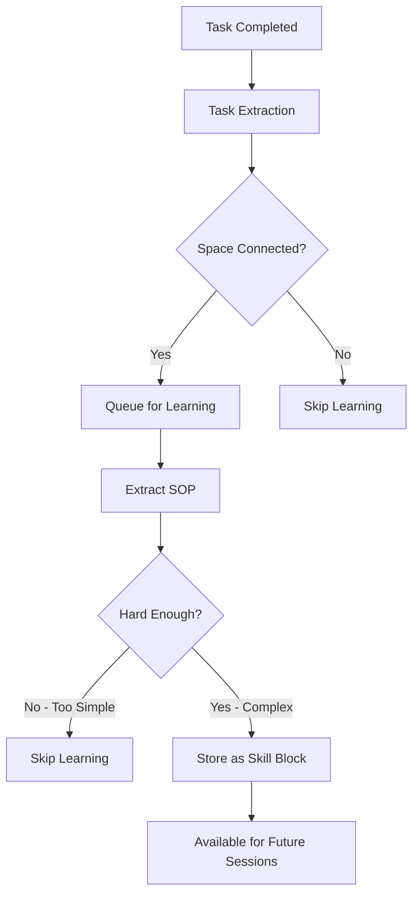

Acontext can enable your agent to self-learn skills and standard operating procedures (SOPs) from successful task executions. When you attach a session to a **Space**, all successfully completed tasks are automatically analyzed and converted into reusable knowledge blocks that your agent can reference in future sessions.

## How Skill Learning Works

When a session is connected to a Space:

1. **Task Extraction**: As your agent works, Acontext automatically [extracts tasks](/observe/agent_tasks) from the conversation
2. **Task Completion**: When tasks are marked as `success`, they're queued for learning
3. **Automatic Learning**: Acontext analyzes the completed task's execution messages and extracts reusable patterns, approaches, and procedures
4. **Skill Storage**: Learned skills and user preferencesare stored in the Space as searchable knowledge blocks
5. **Future Use**: Your agent can retrieve and apply these learned skills

<Note>
For now, only tasks with `success` status are learned into skills. Failed or pending tasks are not processed.
</Note>

## Quick Start: Enable Skill Learning

This example demonstrates how to create a Space and attach sessions to it so your agent can learn and reuse skills.

<CodeGroup>
```python Python
import time
from acontext import AcontextClient

# Initialize client
client = AcontextClient(
    base_url="http://localhost:8029/api/v1",
    api_key="sk-ac-your-root-api-bearer-token"
)

# Step 1: Create a Space for skill learning
space = client.spaces.create()
print(f"Created Space: {space.id}")

# Step 2: Create a session attached to the space
session = client.sessions.create(space_id=space.id)
print(f"Created Session: {session.id}")
print(f"Session is connected to Space: {session.space_id}")

# Step 3: Have your agent work and complete tasks
# This example shows a conversation where the agent outlines and completes a plan
messages = [
    {
        "role": "user",
        "parts": [
            {
                "type": "text",
                "text": "I need to write a landing page of iPhone 15 pro max"
            }
        ]
    },
    {
        "role": "assistant",
        "parts": [
            {
                "type": "text",
                "text": "Sure, my plan is below:\n1. Search for the latest news about iPhone 15 pro max\n2. Init Next.js project for the landing page\n3. Deploy the landing page to the website"
            }
        ]
    },
    {
        "role": "user",
        "parts": [
            {
                "type": "text",
                "text": "That sounds good. Let's first collect the message and report to me before any landing page coding."
            }
        ]
    },
    {
        "role": "assistant",
        "parts": [
            {
                "type": "text",
                "text": "Sure, I will first collect the message then report to you before any landing page coding."
            }
        ]
    },
    {
        "role": "assistant",
        "parts": [
            {
                "type": "text",
                "text": "I need to search the latest news about iPhone 15 pro max first"
            }
        ]
    },
    {
        "role": "assistant",
        "parts": [
            {
                "type": "tool-call",
                "text": "search_news",
                "meta": {
                    "name": "search_news",
                    "arguments": {
                        "query": "iPhone 15 pro max launching"
                    }
                }
            }
        ]
    },
    {
        "role": "assistant",
        "parts": [
            {
                "type": "tool-call",
                "text": "search_news",
                "meta": {
                    "name": "search_news",
                    "arguments": {
                        "query": "iPhone 15 pro max price"
                    }
                }
            }
        ]
    },
    {
        "role": "assistant",
        "parts": [
            {
                "type": "tool-call",
                "text": "search_news",
                "meta": {
                    "name": "search_news",
                    "arguments": {
                        "query": "iPhone 15 pro max features specifications"
                    }
                }
            }
        ]
    },
    {
        "role": "assistant",
        "parts": [
            {
                "type": "text",
                "text": "Based on my search results, here's what I found about the iPhone 15 Pro Max:"
            }
        ]
    },
    {
        "role": "assistant",
        "parts": [
            {
                "type": "text",
                "text": "## iPhone 15 Pro Max Key Information\n\n**Launch Details:**\n- Released in September 2023\n- Available in Natural Titanium, Blue Titanium, White Titanium, and Black Titanium\n\n**Key Features:**\n- 6.7-inch Super Retina XDR display\n- A17 Pro chip with 6-core GPU\n- Pro camera system with 48MP main camera\n- Action Button replacing the mute switch\n- USB-C connectivity\n- Titanium design\n\n**Pricing:**\n- Starting at $1,199 for 256GB\n- 512GB model at $1,399\n- 1TB model at $1,599\n\nThis information should be perfect for creating an engaging landing page. Should I proceed with initializing the Next.js project?"
            }
        ]
    },
    {
        "role": "user",
        "parts": [
            {
                "type": "text",
                "text": "Great research! Yes, please proceed with the Next.js project setup."
            }
        ]
    },
    {
        "role": "assistant",
        "parts": [
            {
                "type": "text",
                "text": "I'll now create the Next.js project for the iPhone 15 Pro Max landing page."
            }
        ]
    }
]

# Send messages to the session
for msg in messages:
    client.sessions.send_message(
        session_id=session.id,
        blob=msg,
        format="acontext"
    )

# Wait for task extraction and completion processing
client.sessions.flush(session.id)

# Check extracted tasks
tasks_response = client.sessions.get_tasks(session.id)
print(f"\nExtracted {len(tasks_response.items)} tasks:")
for task in tasks_response.items:
    print(f"  Task #{task.order}: {task.status}")

print("\n✅ Tasks completed successfully will be learned into the Space as skills!")

```

```typescript TypeScript
import { AcontextClient } from 'acontext-ts';

// Initialize client
const client = new AcontextClient({
    baseUrl: 'http://localhost:8029/api/v1',
    apiKey: 'sk-ac-your-root-api-bearer-token'
});

async function demonstrateSkillLearning() {
    // Step 1: Create a Space for skill learning
    const space = await client.spaces.create();
    console.log(`Created Space: ${space.id}`);

    // Step 2: Create a session attached to the space
    const session = await client.sessions.create({
        spaceId: space.id
    });
    console.log(`Created Session: ${session.id}`);
    console.log(`Session is connected to Space: ${session.space_id}`);

    // Step 3: Have your agent work and complete tasks
    // This example shows a conversation where the agent outlines and completes a plan
    const messages = [
        {
            role: 'user',
            parts: [
                {
                    type: 'text',
                    text: 'I need to write a landing page of iPhone 15 pro max'
                }
            ]
        },
        {
            role: 'assistant',
            parts: [
                {
                    type: 'text',
                    text: 'Sure, my plan is below:\n1. Search for the latest news about iPhone 15 pro max\n2. Init Next.js project for the landing page\n3. Deploy the landing page to the website'
                }
            ]
        },
        {
            role: 'user',
            parts: [
                {
                    type: 'text',
                    text: "That sounds good. Let's first collect the message and report to me before any landing page coding."
                }
            ]
        },
        {
            role: 'assistant',
            parts: [
                {
                    type: 'text',
                    text: 'Sure, I will first collect the message then report to you before any landing page coding.'
                }
            ]
        },
        {
            role: 'assistant',
            parts: [
                {
                    type: 'text',
                    text: 'I need to search the latest news about iPhone 15 pro max first'
                }
            ]
        },
        {
            role: 'assistant',
            parts: [
                {
                    type: 'tool-call',
                    text: 'search_news',
                    meta: {
                        name: 'search_news',
                        arguments: {
                            query: 'iPhone 15 pro max launching'
                        }
                    }
                }
            ]
        },
        {
            role: 'assistant',
            parts: [
                {
                    type: 'tool-call',
                    text: 'search_news',
                    meta: {
                        name: 'search_news',
                        arguments: {
                            query: 'iPhone 15 pro max price'
                        }
                    }
                }
            ]
        },
        {
            role: 'assistant',
            parts: [
                {
                    type: 'tool-call',
                    text: 'search_news',
                    meta: {
                        name: 'search_news',
                        arguments: {
                            query: 'iPhone 15 pro max features specifications'
                        }
                    }
                }
            ]
        },
        {
            role: 'assistant',
            parts: [
                {
                    type: 'text',
                    text: "Based on my search results, here's what I found about the iPhone 15 Pro Max:"
                }
            ]
        },
        {
            role: 'assistant',
            parts: [
                {
                    type: 'text',
                    text: '## iPhone 15 Pro Max Key Information\n\n**Launch Details:**\n- Released in September 2023\n- Available in Natural Titanium, Blue Titanium, White Titanium, and Black Titanium\n\n**Key Features:**\n- 6.7-inch Super Retina XDR display\n- A17 Pro chip with 6-core GPU\n- Pro camera system with 48MP main camera\n- Action Button replacing the mute switch\n- USB-C connectivity\n- Titanium design\n\n**Pricing:**\n- Starting at $1,199 for 256GB\n- 512GB model at $1,399\n- 1TB model at $1,599\n\nThis information should be perfect for creating an engaging landing page. Should I proceed with initializing the Next.js project?'
                }
            ]
        },
        {
            role: 'user',
            parts: [
                {
                    type: 'text',
                    text: 'Great research! Yes, please proceed with the Next.js project setup.'
                }
            ]
        },
        {
            role: 'assistant',
            parts: [
                {
                    type: 'text',
                    text: "I'll now create the Next.js project for the iPhone 15 Pro Max landing page."
                }
            ]
        }
    ];

    // Send messages to the session
    for (const msg of messages) {
        await client.sessions.sendMessage(session.id, msg, {
            format: 'acontext'
        });
    }

    // Wait for task extraction and completion processing
    client.sessions.flush(session.id)

    // Check extracted tasks
    const tasksResponse = await client.sessions.getTasks(session.id);
    console.log(`\nExtracted ${tasksResponse.items.length} tasks:`);
    for (const task of tasksResponse.items) {
        console.log(`  Task #${task.order}: ${task.status}`);
    }

    console.log('\n✅ Tasks completed successfully will be learned into the Space as skills!');
}

demonstrateSkillLearning();
```
</CodeGroup>

<Check>
Once tasks complete successfully, they'll be automatically processed and learned into the Space. This happens asynchronously in the background.
</Check>

## Connecting Existing Sessions to a Space

If you have an existing session that wasn't created with a Space, you can connect it later:

<CodeGroup>
```python Python
# Create a space
space = client.spaces.create()

# Create a session without a space
session = client.sessions.create()

# Later, connect the session to the space
client.sessions.connect_to_space(
    session_id=session.id,
    space_id=space.id
)

print("Session is now connected to the Space!")
print("Future completed tasks will be learned into the Space")
```

```typescript TypeScript
// Create a space
const space = await client.spaces.create();

// Create a session without a space
const session = await client.sessions.create();

// Later, connect the session to the space
await client.sessions.connectToSpace(session.id, {
    spaceId: space.id
});

console.log('Session is now connected to the Space!');
console.log('Future completed tasks will be learned into the Space');
```
</CodeGroup>

## Understanding the Learning Pipeline

When a task completes successfully in a session connected to a Space:




If you ran the above examples, you can find the learned skills in space(view it through the dashboard or API).
You will see that the skill only have user preferences on collecting the product news, but no tool steps.

That's because Acontext judges that the New Searching task is too easy, only the user preferences on this task is worthwhile to learn.

<Frame caption="Skill viewer showing registered agent skills and their execution statistics">

</Frame>

### What Gets Learned

Acontext analyzes the task execution to extract:

- **Procedures**: Step-by-step approaches the agent took
- **Patterns**: Common problem-solving strategies
- **Context**: When and how to apply specific techniques
- **Preferences**: User requirements and constraints mentioned during the task

### Complexity-Based Filtering

Not all completed tasks result in learned skills. After extracting the SOP (Standard Operating Procedure), Acontext evaluates the complexity:

- **Simple tasks** (e.g., single-step operations, basic queries) are **skipped** to avoid cluttering the skill library
- **Complex tasks** (e.g., multi-step workflows, problem-solving patterns) are **stored** as reusable skills

This intelligent filtering ensures your Space contains only valuable, reusable knowledge that improves agent performance.

<Warning>
Tasks that complete **before** a session is connected to a Space will not be learned. Connect sessions to Spaces early to capture all learning opportunities.
</Warning>

## Use Cases

<AccordionGroup>
<Accordion title="Building an Agent Skill Base">
Connect all your agent sessions to a single Space to build a centralized knowledge base. As your agent solves more problems, it accumulates expertise that improves performance across all sessions.

```python
# Create one space for your entire agent system
agent_space = client.spaces.create()

# Connect all agent sessions to this space
session1 = client.sessions.create(space_id=agent_space.id)
session2 = client.sessions.create(space_id=agent_space.id)
session3 = client.sessions.create(space_id=agent_space.id)

# Each successful task across all sessions builds the shared knowledge base
```
</Accordion>

<Accordion title="Team Collaboration and Shared Learning">
Multiple team members' agents can contribute to and benefit from a shared Space, enabling collaborative learning across your organization.

```python
# Shared space for the entire team
team_space = client.spaces.create()

# Different team members create sessions connected to the shared space
alice_session = client.sessions.create(space_id=team_space.id)
bob_session = client.sessions.create(space_id=team_space.id)
carol_session = client.sessions.create(space_id=team_space.id)

# All team members benefit from collective learning
```
</Accordion>

</AccordionGroup>

## Best Practices

<CardGroup cols={2}>
<Card title="Connect Early" icon="link">
Attach sessions to Spaces at creation time to ensure all completed tasks are learned, not after tasks start executing.
</Card>

<Card title="Organize by User" icon="user">
Create separate Spaces for different users to maintain focused, relevant skill libraries.
</Card>

</CardGroup>

## Next Steps

<CardGroup cols={2}>
<Card title="Dashboard" icon="chart-simple" href="/observe/dashboard">
View your agent's tasks and learned skills in the UI
</Card>
<Card title="Search the Skills" icon="database" href="/learn/search-skills">
Use the learned skills to empower your agent to perform more complex tasks.
</Card>
</CardGroup>

